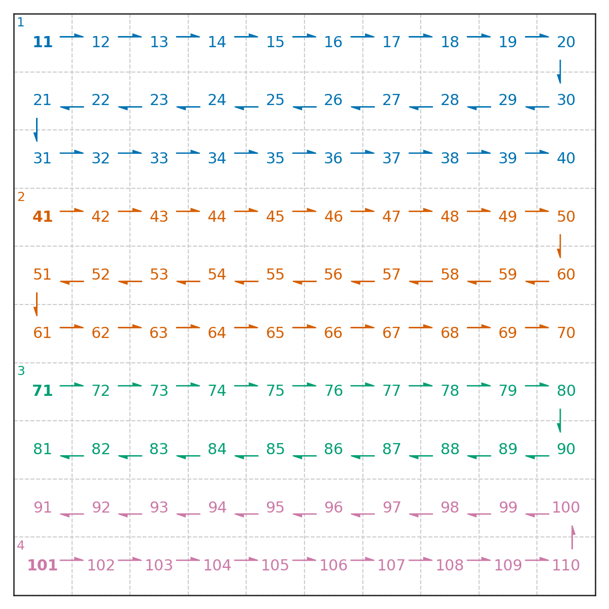
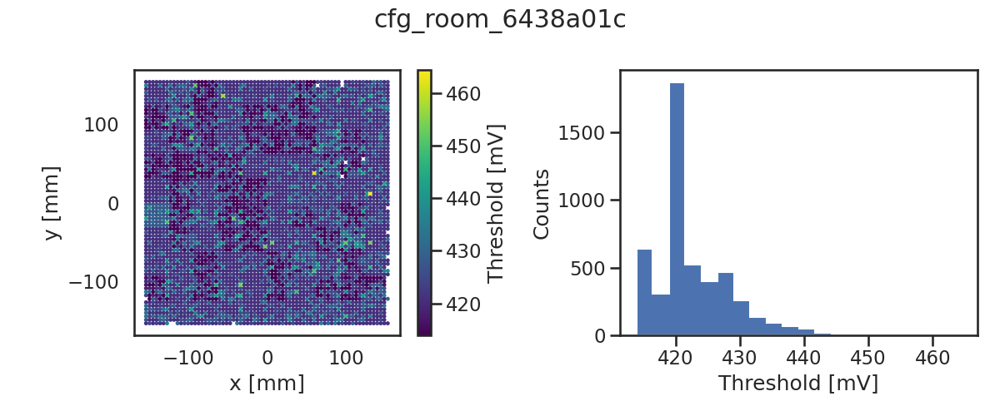

# Tutorial
## Working Enironment

Although **slacube** script works in any folders, a custom working directory
(set to `$SLACUBE_WORKDIR`) is required to store run configurations, temporary
data files and diagonstic outputs.

To create an working environment:
```
   $ slacube env create some_name
```

The environment becomes active **ONLY** after sourcing the setup script:
```
   $ source $(slacube env curr)
```

**-- INSERT SCREENCAST HERE --**

Notes:
- The same working environment is "reusable", provided that the running
  condition remains unchanged.
- Remember the name of the directory (make something unique to you).
- `slacube env curr` shows the setup script for last modified directory, which
  is the most likely environment for the next operation.
- `slacube env list` shows a list of avaliable environments. Source any of them
  to activate.

See `slacube env help` for details.

## Interlude: How to Read Help Pages
**-- INSERT SCREENCAST HERE --**

## Controller Configuration {#hydra}

A tile controller configuration defines the readout topology (i.e. Hyrda
network) of the LArPix ASICs. Once the tile config is generated, it can be used
for the entire run unless there is a re-routing of the network to avoid
problematic chips.

To create a new hydra network:
```
   $ slacube hydra create
```
It will generates a json file, somehting like `tile-id_1-autoconfig.json`.

**-- INSERT SCREENCAST HERE --**

Keep an eye on the output. You should see **FOUR** good root chips:
```
... ...
good root chips:  [11, 41, 71, 101] 
... ...
```

Sometimes one of the root chip does not work, espeically right after power
cycle. In such case, you may abort the job and try it again. The LArPix would
probably works without all 4 root chips, but missing one could indicates some
issues on the tile.

Set the tile config for later operations:
```
   $ slacube hydra set
```
Choose the desired config file and press "Enter" to confirm.
**-- INSERT SCREENCAST HERE --**

Plot the hydra network
```
   $ slacube hydra plot
   Save figure to hydra_6437c4ec.png
```



Notes:
- X-forwarding over SSH maybe slow. Try `sshfs` or other `sftp` clients to view
  the image.
- Only four root chips 11,41,71,101 are connected externally for readout.
- The numbers in the upper corners of the root chips are `io_channel`, which
  gives the communication path for each chip. 
- Each chip belongs to one `io_channel` as indicated in different
  colors.
- If a chip is greyed out, it is not "reachable" from outside. It should not
  be happened in normal operation.
- A **chip key** is an unique identifier in form of `{io_group}-{io_channel}-{chip}`.
  - `io_group=1` for the SLACube setup.
  - `io_channel` is indicated in the figure.
  - `chip` ranges from 11 to 110 (a total of 10x10 ASICs per tile)
- For example, here are valid chip keys: 1-1-13, 1-2-55, 1-3-86, 1-4-101.
- Chip keys for the same ASIC may vary if a different controller config is used.

See `slacube hydra help` for details.

## Trigger Rate Test
 
Trigger rate test identified anomalous channels due to high leakage current. It
produces a bad channel list, where problematic channels are masked in further
operations.

To start a trigger rate test:
```
   $ slacube rate-test start
```
**-- INSERT SCREENCAST HERE --**

A few data files `trigger_rate_*.h5` and a json file started with
`trigger-rate-DO-NOT-ENABLE-channel-list-...` are produced.

To update the new bad channel list:
```
   $ slacube bad-channel set
```
[](https://asciinema.org/a/577455)

Note:
- Use `slacbue cfg` to check the current run configurations, including
  environmental variables and runtime files/directories.

See `slacube rate-test help`, `slacube bad-channel help` and `slacube cfg help`.

## Pedestal Test {#pedestal}

Pedestal test identified channels with large pedestals. A new bad-channel is
generated after the test.

Start a quality control (QC) test:
```
   slacube pedestal start-qc
```
A short pedestal run is taken `pedestal_...h5`.
A new bad channel list is generated `pedestal-bad-channels-...json`.
Another short pedetal run is taken with the updated bad channe list `recursive_pedestal_...json`.

Make pedestal plots:
```
   slacube pedestal plot
```
Select pedestal file, and press "Enter".

**-- INSERT FIGURES HERE --**

Notes:
- For further diagonstic, a csv file is provided from the plot command.
- Do not pay attention to the empty patterns on the pedestal figures. These are
  known features.
- The QC test only mask the bad channel with large pedestal > 125 ADC. It is
  possible to mask channels with high std, `start-qc --apply_noise_cut --noise_cut_value MAX_STD`,
  which is less often used.
- You can mask individual channel manually using the chip-key + channel (see later).

Set the latest bad channel list:
```
   slacube bad-channel set
```
Pick the latest `pedestal-bad-channels-...json` and press "Enter".

Double check with a single pedeatal run (without QC test):
```
   slacube pedestal start
```
It only take a single pedestal run and does not produce a new bad channel list.
Plot the latest pedestal file and check the figure.

At this point, most of the bad channels are masked automatically by rate and
pedestal QC tests. A few more channels might still need be added manually. As
for safety break point, it is recommended to duplicate the bad channel list at
this stage.

Copy the current bad channel list:
```
   slacube bad-channel copy
```
A new copy of the json file is set for later operation.

See `slacube pedestal help`.

## Interlude: How to Add Bad Channel

Mask ALL channels of chip 1-3-88
```
   slacube bad-channel add 1-3-88
```
Follow the prompt question. Press `y <Enter>` to proceed.

Mask channels 1,3,5 of chip 1-4-102
```
   slacube bad-channel add 1-4-102 1,3,5
```
Input the target channels as a comma separated list (no space).

[](https://asciinema.org/a/A2azay8kgJ50I1uNkWuzdKBfO)

Notes:
- The `add` command overwirtes (edit inplace) the current bad channel list. It
  is recommended to make a copy before editing. See [Pedestal](#pedestal).
- There is **NO** validity check on the chip-key. See [Controller
  Configuration](#hydra) .
- There is **NO** unmask function. Simply revert the changes using `set`
  commnad to one of the previous versions.
- It is possible to edit the bad channel list json file manually.
- It is _unlikely_ to make extensive edit on the bad channel list.

See `slacube bad-channel help`

## Threshold Setting

The `threshold` command determines the self-triggered threshold for each
channel. The goal is to keep the trigger rate as low as 2 Hz per channels.
The algorithm is based on a reference pedestal file.

After the preparation of the bad channel list, set a reference pedestal file:
```
   slacube pedestal set
```
Pick the latest and greatest pedestal run.

Generate threshold config (at room temperatue):
```
   slacube threshold start
```

Generate threshold config (at cryo temperatue):
```
   slacube threshold start --cryo
```

[](https://asciinema.org/a/1oiJ1xe2QI66HVKhbb6NRIZuU)

Once the threshold setting process is finished, the script will automatically
set `CFG_DIR` to a newly generated folder. Remember this locatoin as you may
need to fine-tune the thresholds manually.

If the following error shows up:
```
total packets 33475     1-1-19 21031
offending channel, triggers: [(10, 21031)]
                high rate channels! raise global threshold 40
Traceback (most recent call last):
  File "/home/slacube/app/scripts/larpix_qc/threshold_qc.py", line 715, in <module>
    c = main(**vars(args))
  File "/home/slacube/app/scripts/larpix_qc/threshold_qc.py", line 600, in main
    enable_frontend(c, channels, csa_disable)
  File "/home/slacube/app/scripts/larpix_qc/threshold_qc.py", line 257, in enable_frontend
    raise RuntimeError(diff,'\nconfig error on chips',list(diff.keys()))
RuntimeError: ({Key('1-1-19'): {73: (252, None)}}, '\nconfig error on chips', [Key('1-1-19')])
```
Look for the line about _offending channel_ and the line before. In this
example, chip-key:1-1-19 channel:10 is causing the trouble. Mask out the
problematic channel.
```
   slacube bad-channel add 1-1-19 10
```

Repeat `slacube threshold start [--cryo]` until no futher error pops out.
Sometimes it takes a few iterations, however, having a large nubmer of bad
channels may indicate fundamental problem with the setup.

Plot the thresholds:
```
  slacube threshold plot
```
Answer the prompt questions.



Notes:
- For diagonstic purpose, you can use `VDDA=1800` (just press "<Enter>"). For
  more precise voltage readout, see [Power Management](#power).
- For cryo (cold) operation, answer `y` in the `is_cryo?` prompt question.
- The thresholds are ~400+/-50 mV (at room temperature) and ~700+/-50 mV
  (cryo).

See `slacube threshold help`

## Threshold Adjustment

There are two type of thresholds:
1. global threshold (coarser) each chip, ranges 0-255,
2. trim threshold (finner) for each channel, ranges 0-31.

To increase global threshold of 1-3-86 by 2 DAC,
```
   slacube threshold adjust global +2 1-3-86
```

To decrease global threshold of 1-4-103 by 1 DAC,
```
   slacube threshold adjust global -1 1-4-103
```

To increase trim threshold of 1-1-28 (all channels) by 3 DAC,
```
   slacube threshold adjust trim +3 1-1-28
```

To decrease trim threshold of 1-2-55 (channels 1,5,9) by 2 DAC,
```
   slacube threshold adjust trim -2  1-2-55 1,5,9
```

See `slacube threshold help`
